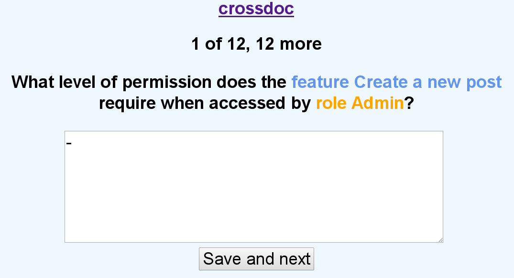

                                _
      ___ _ __ ___  ___ ___  __| | ___   ___
     / __| '__/ _ \/ __/ __|/ _` |/ _ \ / __|
    | (__| | | (_) \__ \__ \ (_| | (_) | (__
     \___|_|  \___/|___/___/\__,_|\___/ \___|

Welcome to crossdoc
===================

First of all: crossdoc is a hack! That said...

crossdoc is a simple mechanism to uncover cross cutting concerns by
creating a complete documentation.

crossdoc is a tiny web app and has been designed for a group of people
conducting a workshop or having a discussion. crossdoc is written in
Ruby based on Sinatra and fully customizable via YAML.

## Run

Copy `example.yml` and modify to resemble your problem. (The
file `result.yml` will automatically be created.) Then run...

    ruby crossdoc.rb example.yml result.yml

Now head over to 4567 and start documenting

    http://localhost:4567/

## Screenshot

## Notes on development

    rerun -p crossdoc.rb 'ruby crossdoc.rb example.yml result.yml'
